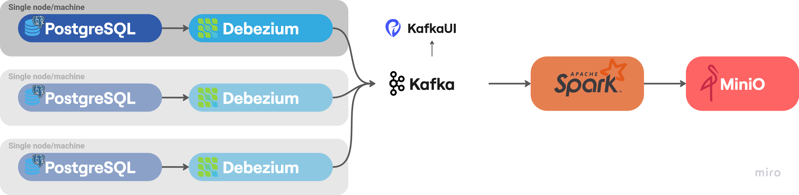
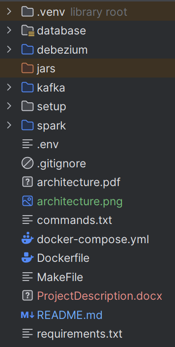

# 🚀 Multi-Server Data Infrastructure Template

Welcome! This repository showcases a production-ready, modular ecosystem for modern data pipeline development. Powered by leading open-source technologies (PostgreSQL, Kafka, Debezium, Spark, MinIO), this stack enables scalable data ingestion, streaming, transformation, and datalake storage — **all effortlessly orchestrated with Docker.**

---

## 🧩 Architecture Overview

- 🗄️ **PostgreSQL**: Reliable source of transactional truth.
- 🚦 **Kafka**: Distributed message streaming at scale.
- 🛰️ **Debezium**: Change Data Capture (CDC) streaming DB changes into Kafka.
- ⚡ **Spark**: Parallelized processing, analytics, and transformation straight from Kafka topics.
- 🗳️ **MinIO**: S3-compatible object storage for datalake or lakehouse workflows.

All components are containerized and orchestrated with Docker Compose, enabling fast setup on any server or cloud environment.

---

## 🌎 Key Features

- **Pluggable Microservices:** Effortlessly scale and swap components.
- **Datalake Ready:** Store, archive, and serve data for machine learning and analytics.
- **CDC-Driven Pipelines:** Automatic, near real-time database-to-lake flow.
- **Unified .env Configuration:** Manage secrets and endpoints centrally.
- **Easy Deployment:** No more “works on my machine” — just one command fires up everything!

---

## 🛠️ Getting Started

### 1. Clone the Repository
``
git clone https://github.com/YOUR_USERNAME/YOUR_REPO.git
cd YOUR_REPO
``

### 2. Configure Environment Variables

Edit the `.env` file to suit your local or production environment (DB passwords, MinIO keys, etc).

### 3. Build and Launch the Stack

**Build Images:**
``
docker-compose build
``

**Start All Services:**
``
docker-compose up -d
``

🟢 That’s it! All containers (Postgres, Kafka, Debezium, Spark, MinIO) will be running and connected.  

🔍 To check logs, use:
``
docker-compose logs -f
``

🔴 To stop everything:
``
docker-compose down
``

---

## 🏗️ Project Structure

---

## 🌟 Why This Stack?

- **Ready for Multiserver/Data Lake Deployments.**
- **Perfect for Real-Time/Batch Analytics.**
- **Extensible, Standardized, Community-Proven.**
- **Deploys Anywhere Docker Runs—Cloud, Local, Hybrid!**

---

## 📚 Resources

- [Docker](https://docker.com)
- [Kafka](https://kafka.apache.org)
- [Debezium](https://debezium.io)
- [Spark](https://spark.apache.org)
- [MinIO](https://min.io)

[//]: # ([![Review Assignment Due Date]&#40;https://classroom.github.com/assets/deadline-readme-button-22041afd0340ce965d47ae6ef1cefeee28c7c493a6346c4f15d667ab976d596c.svg&#41;]&#40;https://classroom.github.com/a/DSQR5M_a&#41;)

